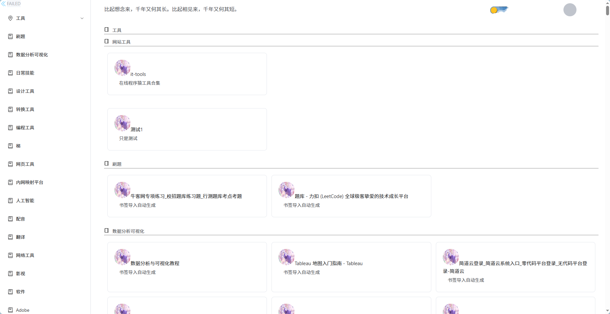
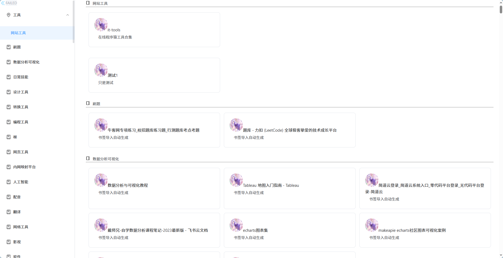
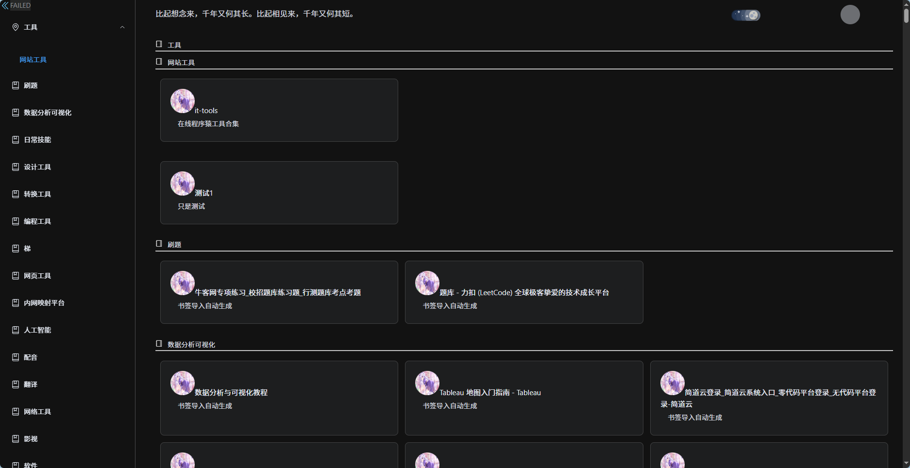
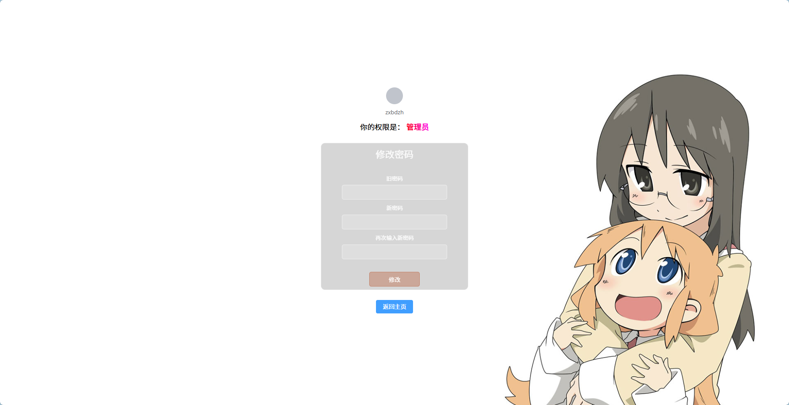
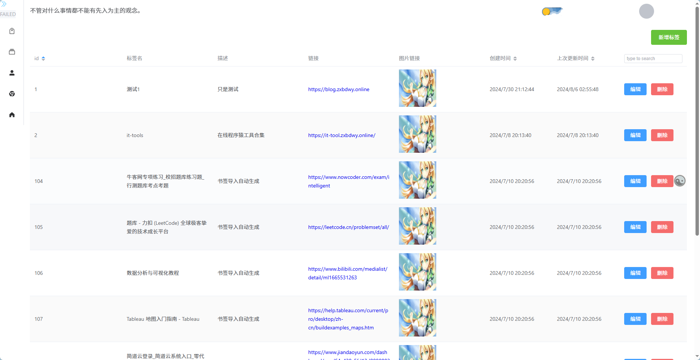
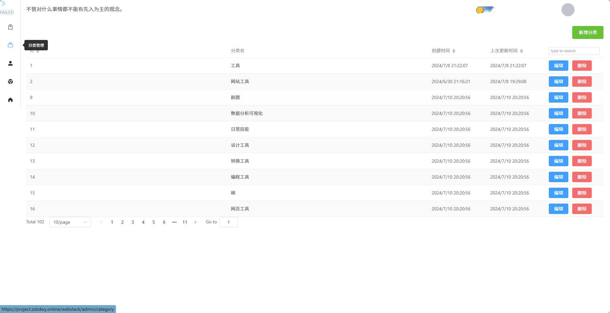
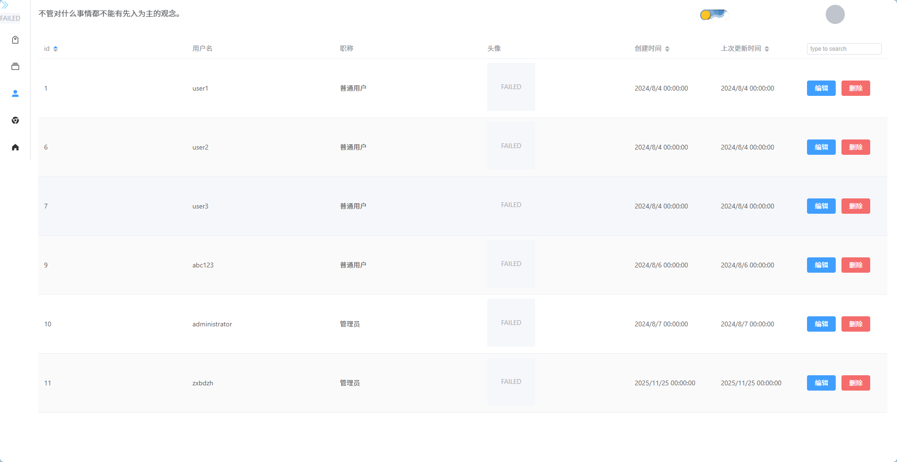
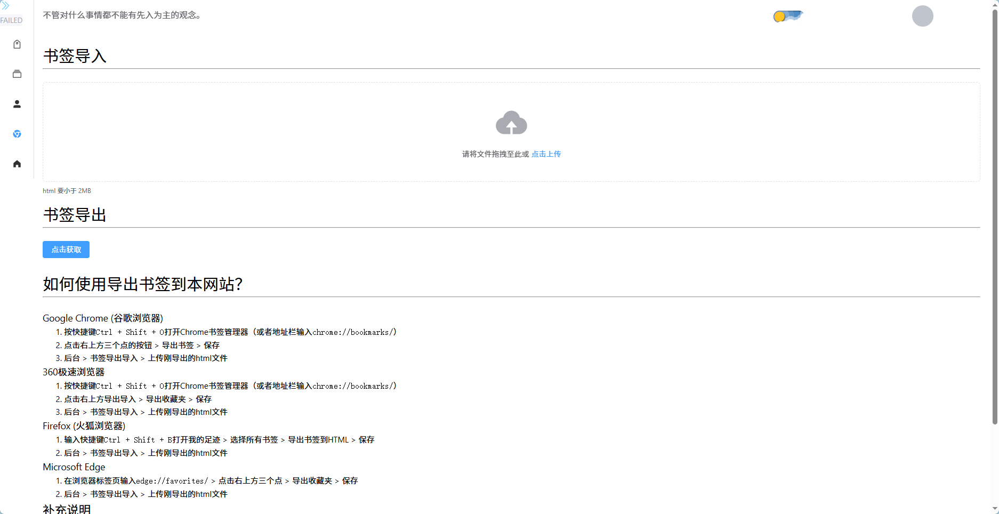

# webstack-vue

> 使用 Vue 3 + Vite 构建的现代化网址导航系统
>
> 原项目灵感来源:[WebStackPage](https://github.com/WebStackPage/WebStackPage.github.io)

[](https://vuejs.org/)
[](https://vitejs.dev/)
[](https://element-plus.org/)
[](LICENSE)

---

## 📖 项目介绍

webstack-vue 是一个基于 Vue 3 生态构建的网址导航/书签管理系统,提供书签收藏、分类管理、用户系统以及完整的后台管理功能。前端采用现代化技术栈,后端通过独立 API 服务对接,可用于个人书签云端管理或团队站点导航中心。

### ✨ 核心特性

- 🌟 **现代化界面** —— Vue 3 + Element Plus,简洁优雅
- 📱 **响应式布局** —— 桌面端、平板、移动端自适应
- 🌙 **主题切换** —— 一键切换亮色 / 暗黑模式
- 🔖 **书签导入导出** —— 兼容 Chrome / Edge / Firefox / 360 浏览器
- 📂 **多级分类** —— 支持父子级分类组织
- 🛠️ **完整后台** —— 标签、分类、用户、书签四大模块
- 👥 **用户体系** —— 注册、登录、密码修改、权限区分
- 📖 **新手引导** —— 基于 Driver.js 的首次使用引导

---

## 🖼️ 界面预览

### 首页导航(亮色模式)

清爽的卡片式书签陈列,左侧分类导航一目了然。



### 侧边栏分类展开

支持父子级分类切换,定位精准。



### 首页导航(暗黑模式)

护眼舒适的暗黑主题,夜间浏览更友好。



### 用户中心 - 修改密码

显示当前用户身份与权限,提供密码修改入口。



### 后台管理 - 标签管理

对所有书签条目进行集中维护,支持图标、链接、来源备注等字段。



### 后台管理 - 分类管理

管理书签的一级、二级分类结构,支持分页与搜索。



### 后台管理 - 用户管理

管理员可对系统用户进行查看、编辑、删除及权限分配。



### 书签导入导出

支持上传浏览器导出的 HTML 文件,自动生成卡片;同时支持反向导出。



---

## 🚀 技术栈

### 前端核心

| 技术 | 说明 |
|------|------|
| **Vue 3** | 渐进式 JavaScript 框架 (Composition API) |
| **Vue Router 4** | 官方路由管理器 |
| **Pinia** | 新一代 Vue 状态管理库 |
| **Pinia Plugin Persistedstate** | Pinia 状态持久化插件 |

### UI 与样式

| 技术 | 说明 |
|------|------|
| **Element Plus** | Vue 3 桌面端 UI 组件库 |
| **Element Plus Icons** | 官方图标组件库 |

### 构建与工程化

| 技术 | 说明 |
|------|------|
| **Vite** | 下一代前端构建工具 |
| **Vue DevTools** | Vue 调试工具 |
| **unplugin-auto-import** | API 自动导入 |
| **unplugin-vue-components** | 组件自动注册 |

### 工具库

| 技术 | 说明 |
|------|------|
| **Axios** | HTTP 客户端 |
| **VueUse** | Vue 组合式 API 工具集 |
| **Driver.js** | 用户操作引导库 |

### 代码规范

| 技术 | 说明 |
|------|------|
| **ESLint** | 代码质量检查 |
| **Prettier** | 代码格式化 |

---

## 📁 项目结构

```
webstack-vue/
├── docs/
│   └── screenshots/         # 项目截图
├── public/                  # 静态资源
│   └── favicon.ico
├── src/
│   ├── assets/              # 资源文件 (css / js / 图片)
│   ├── components/          # 公共组件
│   │   ├── form/            # 表单子组件
│   │   ├── AdminSideBar.vue # 后台侧边栏
│   │   ├── CardHeader.vue   # 卡片头部
│   │   ├── CardVue.vue      # 书签卡片
│   │   ├── CommonHeader.vue # 公共顶部栏
│   │   ├── CommonUpload.vue # 通用上传组件
│   │   ├── SideBar.vue      # 前台侧边栏
│   │   └── ToggleDarkButton.vue # 主题切换按钮
│   ├── router/              # 路由配置
│   ├── stores/              # Pinia 状态
│   ├── utils/               # 工具函数 (axios 封装等)
│   ├── views/
│   │   ├── Admin/           # 管理员页面
│   │   ├── User/            # 用户页面
│   │   └── HomeView.vue     # 首页
│   ├── App.vue              # 根组件
│   └── main.js              # 入口文件
├── .env.development         # 开发环境变量
├── .env.production          # 生产环境变量
├── .eslintrc.cjs            # ESLint 配置
├── .prettierrc.json         # Prettier 配置
├── index.html               # HTML 模板
├── jsconfig.json            # JS 路径别名
├── package.json
├── pnpm-lock.yaml
├── vite.config.js           # Vite 配置
└── README.md
```

---

## 🛠️ 快速开始

### 环境要求

- **Node.js** >= 16.0.0
- **pnpm** >= 7.0.0 (推荐) 或 **npm** >= 8.0.0

### 安装与运行

```bash
# 1. 克隆仓库
git clone https://github.com/zxbdzh/webstack-vue.git
cd webstack-vue

# 2. 安装依赖 (推荐 pnpm)
pnpm install

# 3. 启动开发服务器
pnpm dev

# 4. 构建生产版本
pnpm build

# 5. 本地预览生产构建
pnpm preview
```

### 环境配置

修改根目录下的环境变量文件:

```env
# .env.development
VITE_API_URL=http://localhost:3000/api

# .env.production
VITE_API_URL=https://your-api-domain.com/api
VITE_BASE_API=/
```

### 后端服务

本项目仅为前端实现,需配合后端 API 服务运行:

> 🔗 后端仓库:[webstack-backend](https://github.com/zxbdzh/webstack-backend)

请按照后端项目的 README 完成部署与配置。

---

## 📋 常用命令

| 命令 | 说明 |
|------|------|
| `pnpm dev` | 启动开发服务器(热更新) |
| `pnpm build` | 构建生产版本 |
| `pnpm preview` | 本地预览生产构建 |
| `pnpm lint` | ESLint 代码检查并修复 |
| `pnpm format` | Prettier 格式化代码 |

---

## 🚢 部署指南

### Nginx 配置示例

```nginx
server {
    listen 80;
    server_name your-domain.com;
    root /path/to/webstack-vue/dist;
    index index.html;

    # SPA 路由 fallback
    location / {
        try_files $uri $uri/ /index.html;
    }

    # API 反向代理
    location /api {
        proxy_pass http://your-backend-api;
        proxy_set_header Host $host;
        proxy_set_header X-Real-IP $remote_addr;
        proxy_set_header X-Forwarded-For $proxy_add_x_forwarded_for;
        proxy_set_header X-Forwarded-Proto $scheme;
    }
}
```

> OpenResty 部署方式与 Nginx 完全兼容,可直接复用上述配置。

---

## 🌟 功能详解

### 前台功能

- **🏠 首页导航** —— 卡片式书签陈列,折叠 / 展开侧边栏
- **🔍 分类浏览** —— 多级分类,层级清晰
- **🌙 主题切换** —— 亮色 / 暗黑一键切换,自动持久化
- **👤 个人中心** —— 修改密码、查看权限
- **📖 新手引导** —— 首次访问自动启动操作引导

### 后台功能(管理员)

| 模块 | 功能 |
|------|------|
| **标签管理** | 书签条目的增删改查、批量管理、图标与链接维护 |
| **分类管理** | 一级 / 二级分类的层级管理 |
| **用户管理** | 用户列表、权限分配、账号操作 |
| **书签导入导出** | 支持 Chrome / Edge / Firefox / 360 浏览器的 HTML 书签互导 |

### 浏览器书签导入说明

| 浏览器 | 导出步骤 |
|--------|----------|
| **Chrome / 360 极速** | `Ctrl + Shift + O` → 右上角三个点 → 导出书签 → 保存 |
| **Firefox** | `Ctrl + Shift + B` → 打开"我的足迹" → 选择所有书签 → 导出书签为 HTML |
| **Microsoft Edge** | 地址栏访问 `edge://favorites/` → 右上角三个点 → 导出收藏夹 |

随后在"书签导入"页面上传得到的 HTML 文件即可。

---

## 🔧 开发指南

### 新增页面

1. 在 `src/views/` 下创建页面组件
2. 在 `src/router/index.js` 注册路由
3. 如需状态管理,在 `src/stores/` 创建对应 Pinia store
4. 公共组件抽离到 `src/components/`

### 编码约定

- 优先使用 **Vue 3 Composition API** (`<script setup>`)
- 样式遵循 **BEM** 命名规范
- 优先使用 **Element Plus** 设计令牌,保证主题一致性
- 提交前执行 `pnpm lint` 与 `pnpm format`

---

## 🤝 贡献指南

欢迎提交 Issue 与 Pull Request!

1. Fork 本仓库
2. 创建特性分支:`git checkout -b feature/AmazingFeature`
3. 提交修改:`git commit -m 'feat: add some AmazingFeature'`
4. 推送分支:`git push origin feature/AmazingFeature`
5. 提交 Pull Request

---

## 📄 许可证

本项目基于 [MIT License](LICENSE) 开源。

---

## 🙏 致谢

- [WebStackPage](https://github.com/WebStackPage/WebStackPage.github.io) —— 原始项目灵感
- [Vue.js](https://vuejs.org/) —— 渐进式 JavaScript 框架
- [Element Plus](https://element-plus.org/) —— Vue 3 UI 组件库
- [Vite](https://vitejs.dev/) —— 下一代前端构建工具
- [VueUse](https://vueuse.org/) —— Vue 组合式 API 工具集

---

## 📞 联系方式

- 提交 [Issue](https://github.com/zxbdzh/webstack-vue/issues)
- GitHub:[@zxbdzh](https://github.com/zxbdzh)

---

⭐ 如果这个项目对你有帮助,欢迎 **Star** 支持一下!
